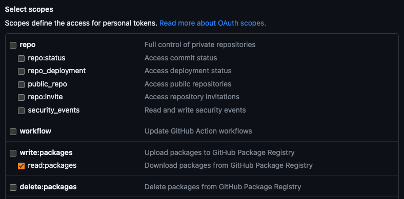
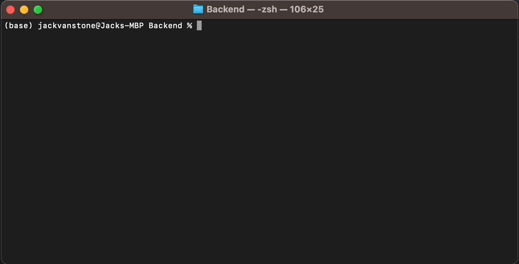
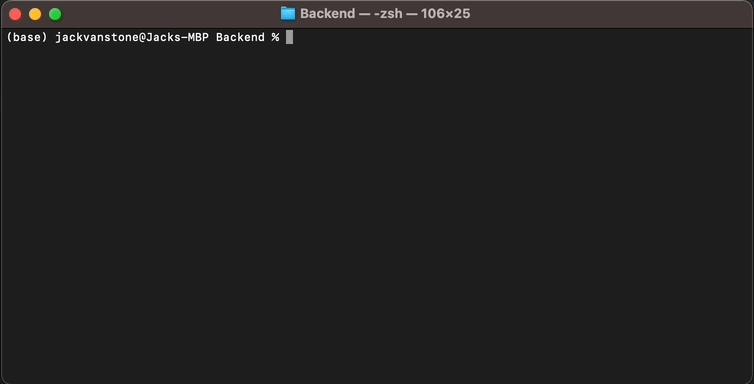

<span style="display: flex; justify-content: center; align-items: center; gap: 20px; font-size: 32px; font-weight: bold">
    
    FoodCLUB Backend
</span>

## Getting Started

Navigate to a new folder for the Backend repo and run
```shell
git clone https://github.com/FoodCLUBDevelopment/Backend.git
```

## Dependencies

In order to install FoodCLUB dependencies, you will need to generate a personal access token on GitHub and save it as an environment variable on your machine.

To generate a token, follow [this guide](https://docs.github.com/en/authentication/keeping-your-account-and-data-secure/managing-your-personal-access-tokens#creating-a-personal-access-token-classic). You will need to ensure that your token has the scope `read:packages`.



### Saving Your Token As An Environment Variable

### macOS
To determine your shell type, run the command `echo $SHELL` in your terminal.

Add the line `export FOODCLUB_PACKAGES_TOKEN=your_token` to either the file `~/.zshrc` if your shell type is `zsh` or `~/.bashrc` if your shell type is `bash`.

To save the changes, run `source ~/.zshrc` or `source ~/.bashrc`.

Test your changes using `echo $FOODCLUB_PACKAGES_TOKEN`.

### Windows

Run the command `setx FOODCLUB_PACKAGES_TOKEN "your_token"` in the command line.

Test your changes by closing the current command line, opening a new one and running `echo %FOODCLUB_PACKAGES_TOKEN%`.

## Installing Doppler

We use Doppler to centrally manage our backend secrets. When we start the backend server, the Doppler CLI retrieves the latest secrets and injects them into the process as environment variables.

> You will need to request access to the [Doppler team](https://dashboard.doppler.com/workplace/8de8a8f6e6b4e48d28bb/projects) before proceeding.

Install the [Doppler CLI](https://docs.doppler.com/docs/install-cli).

### macOS - Using [brew](https://brew.sh/)
```shell
$ brew install gnupg

$ brew install dopplerhq/cli/doppler
```

### Windows - Using [scoop](https://scoop.sh/)
```shell
$ scoop bucket add doppler https://github.com/DopplerHQ/scoop-doppler.git

$ scoop install doppler
```

### Windows - Using [Git Bash](https://gitforwindows.org/)
```shell
$ mkdir -p $HOME/bin

$ curl -Ls --tlsv1.2 --proto "=https" --retry 3 https://cli.doppler.com/install.sh | sh -s -- --install-path $HOME/bin
```

Ensure you have Doppler installed using `doppler --version` and update to the latest version using `doppler update`.

### Login to Doppler

Login using `doppler login`.



### Configure Doppler

Configure using `doppler setup`.



## Starting the Server

Install dependencies using `npm install`.

Start the server in development mode with debug request logging using `npm run devStart`.

Start the server in production mode using `npm run start`.

