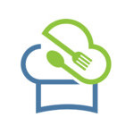

<span style="display: flex; justify-content: center; align-items: center; gap: 20px; font-size: 32px; font-weight: bold">
    
    FoodCLUB Backend
</span>

## Getting Started

Navigate to a new folder for the Backend repo and run
```shell
git clone https://github.com/FoodCLUBDevelopment/Backend.git
```

## Installing Doppler

> You will need to request access to the [Doppler team](https://dashboard.doppler.com/workplace/8de8a8f6e6b4e48d28bb/projects) before proceeding.

Install the [Doppler CLI](https://docs.doppler.com/docs/install-cli).

### macOS - Using [brew](https://brew.sh/)
```shell
$ brew install gnupg

$ brew install dopplerhq/cli/doppler
```

### Windows - Using [scoop](https://scoop.sh/)
```shell
$ scoop bucket add doppler https://github.com/DopplerHQ/scoop-doppler.git

$ scoop install doppler
```

### Windows - Using [Git Bash](https://gitforwindows.org/)
```shell
$ mkdir -p $HOME/bin

$ curl -Ls --tlsv1.2 --proto "=https" --retry 3 https://cli.doppler.com/install.sh | sh -s -- --install-path $HOME/bin
```

Ensure you have Doppler installed using `doppler --version` and update to the latest version using `doppler update`.

### Login to Doppler

Login using `doppler login`.


### Configure Doppler

Configure using `doppler setup`.


## Starting the Server

Install dependencies using `npm install`.

Start the server in development mode with debug request logging using `npm run devStart`.

Start the server in production mode using `npm run start`.

